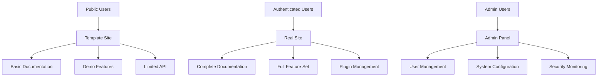

# Welcome to Beam Website System

A modern, comprehensive website and documentation system with intelligent access control. The public site serves as a "template docs site" showcasing basic features, while authenticated users gain access to the full, real site with complete functionality.

## 🚀 Quick Start

Get started with Beam Website System in minutes:

```bash
npm install beam-website-system
```

```javascript
import { BeamWebsite } from 'beam-website-system';

const website = new BeamWebsite({
  apiKey: 'your-api-key',
  environment: 'production'
});

// Initialize the website system
await website.initialize();

// Access public template site
const publicSite = website.getPublicSite();

// Access private real site (requires authentication)
const privateSite = website.getPrivateSite();
```

## ✨ Key Features

### Public/Private Access Pattern
- **Template Site**: Limited, generic documentation for public users
- **Real Site**: Complete functionality for authenticated users
- **Role-Based Control**: Different access levels for users, moderators, and admins
- **Seamless Transition**: Smooth upgrade path from public to private access

### Modern Architecture
- **React Frontend**: Modern, responsive UI with dark mode support
- **Node.js Backend**: Robust API with comprehensive middleware
- **Plugin System**: Extensible architecture with third-party plugin support
- **Authentication**: Multiple auth methods including GitHub OAuth
- **Database**: Flexible data storage with migration support

### Component System
- **Beam Components**: Consistent, reusable UI components
- **Design System**: Comprehensive visual design tokens and themes
- **Accessibility**: WCAG 2.1 AA compliant components
- **Performance**: Optimized for speed and user experience

## 🏗️ Architecture

Beam Website System uses a sophisticated access control architecture:



## 📊 Performance Benchmarks

| Metric | Value |
|--------|-------|
| **Page Load Time** | <2 seconds |
| **API Response Time** | <100ms |
| **Availability** | 99.9% uptime |
| **Scalability** | Auto-scaling support |

## 🔐 Enterprise Security

- **End-to-end Encryption**: All data encrypted in transit and at rest
- **Role-based Access Control**: Fine-grained permissions and security
- **Audit Logging**: Comprehensive audit trails for compliance
- **OAuth Integration**: Secure authentication with multiple providers

## 💰 Pricing

| Plan | Price | Features | Access |
|------|-------|----------|--------|
| **Public** | Free | Template site, basic docs | Limited |
| **User** | $29/month | Full site access, all features | Complete |
| **Admin** | $99/month | Admin panel, user management | Full control |

## 🆘 Support & Community

- 📚 [Documentation](getting-started.md) - Comprehensive guides and tutorials
- 💬 [Community Forum](https://community.beam-website.com) - Connect with other users
- 📧 [Email Support](mailto:support@beam-website.com) - Direct support for all plans
- 🎯 [Live Chat](https://beam-website.com/chat) - Real-time assistance

## 🚀 Ready to Get Started?

Choose your path:

- **[Quick Start Guide](getting-started.md)** - Get up and running in 5 minutes
- **[Installation Guide](installation.md)** - Detailed setup instructions
- **[API Reference](api-reference.md)** - Complete API documentation
- **[Examples](examples.md)** - Sample code and use cases

## 🔐 Access Control

### Public Access (Template Site)
- Basic documentation and guides
- Demo features and examples
- Limited API endpoints
- Marketing and showcase content

### Private Access (Real Site)
- Complete documentation
- Full feature set
- Admin dashboard
- Plugin management
- Analytics and reporting

### Admin Access
- User management
- Content management
- System configuration
- Plugin installation
- Security monitoring

## 🧩 Plugin System

The Beam system includes a comprehensive plugin architecture:

- **Core Features**: Essential functionality built into the system
- **Third-Party Plugins**: Extensible functionality through plugins
- **Plugin Management**: Install, configure, and manage plugins
- **AI Integration**: Plugins can integrate with AI chat system

## 🎨 Design System

- **Beam Components**: Consistent UI component library
- **Theme Support**: Light, dark, and high contrast themes
- **Responsive Design**: Mobile-first approach
- **Accessibility**: WCAG 2.1 AA compliance

---

**Beam Website System** - Modern documentation and website platform with intelligent access control.
